# Apex Retail Retention Orchestrator — Design Document

> **System:** AI-driven customer churn prevention platform  
> **Stack:** Python · LangGraph · FastAPI · Azure OpenAI · React · TypeScript  
> **Date:** April 2026

---

## Table of Contents

1. [System Overview](#1-system-overview)
2. [High-Level Architecture](#2-high-level-architecture)
3. [Agent Workflow (LangGraph DAG)](#3-agent-workflow-langgraph-dag)
4. [Signal Aggregation — Parallel Fan-Out](#4-signal-aggregation--parallel-fan-out)
5. [Churn Scoring Model](#5-churn-scoring-model)
6. [Human-in-the-Loop Approval Flow](#6-human-in-the-loop-approval-flow)
7. [API & Real-Time Communication](#7-api--real-time-communication)
8. [Frontend UI Architecture](#8-frontend-ui-architecture)
9. [State Machine & Data Model](#9-state-machine--data-model)
10. [Key Design Decisions](#10-key-design-decisions)
11. [Technology Choices](#11-technology-choices)
12. [Security & Operational Considerations](#12-security--operational-considerations)

---

## 1. System Overview

The Apex Retail Retention Orchestrator is an **agentic AI system** that automatically detects at-risk retail customers, aggregates signals from six external platforms, computes a composite churn-risk score, selects a margin-safe personalised offer, generates multi-channel outreach content, and — for high-risk decisions — routes to a human approver before any campaign is dispatched.

```
Customer behaviour detected
        ↓
  Trigger event sent to API
        ↓
  Parallel data collection (6 systems)
        ↓
  Composite churn-risk scoring
        ↓
  GPT-powered offer selection
        ↓
  [HIGH risk?] → Human approval gate
        ↓
  Multi-channel content generation
        ↓
  Campaign dispatched
```

---

## 2. High-Level Architecture

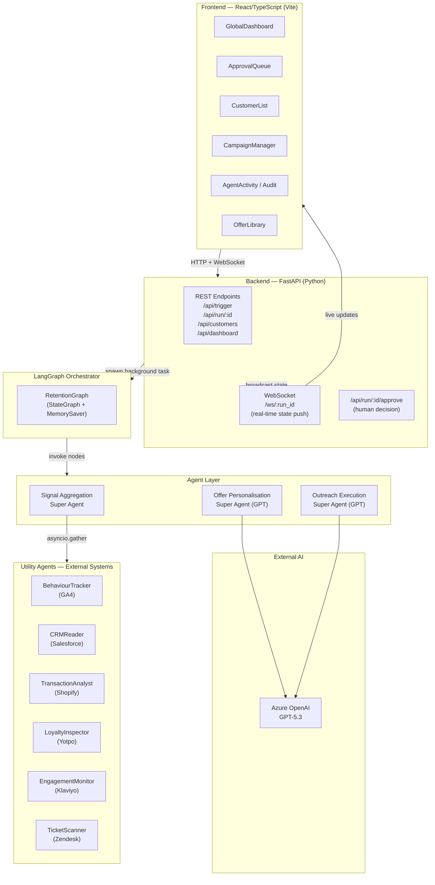

---

## 3. Agent Workflow (LangGraph DAG)

The entire retention process is encoded as a **directed acyclic graph (DAG)** of async nodes managed by LangGraph's `StateGraph`. Each node reads from and writes to a single shared `RetentionState`.

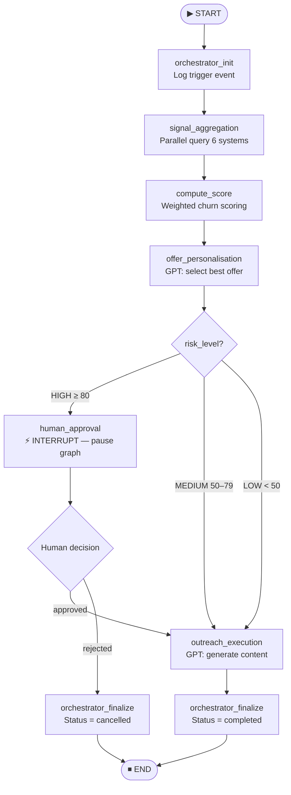

### Node Responsibilities

| Node | Agent | Description |
|---|---|---|
| `orchestrator_init` | Orchestrator | Stamps run metadata, appends first audit entry |
| `signal_aggregation` | Super Agent | Fans out to 6 utility agents in parallel; detects cross-system conflicts |
| `compute_score` | Scoring module | Weighted fusion of 6 signal dimensions → composite score (0–100) |
| `offer_personalisation` | Super Agent + GPT | Selects intervention type and offer using GPT with margin-safety guardrails |
| `human_approval` | Interrupt node | Pauses graph; waits for human decision via REST API |
| `outreach_execution` | Super Agent + GPT | Generates personalised email/SMS/push content; respects channel fatigue |
| `orchestrator_finalize` | Orchestrator | Closes run; writes terminal audit entry |

---

## 4. Signal Aggregation — Parallel Fan-Out

All six external-system utility agents are called simultaneously using `asyncio.gather`. This collapses what could be 6 sequential network calls into a single parallel round-trip.

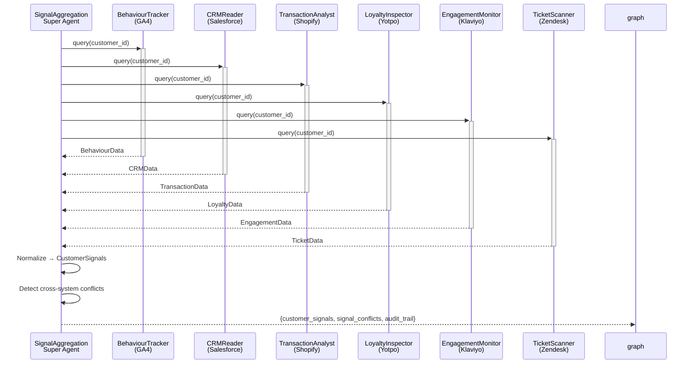

### Conflict Detection Rules

| Condition | Interpretation |
|---|---|
| CRM `active` + GA4 `session_collapse_detected` | CRM data is stale — customer already disengaging |
| High `order_frequency` + negative `sentiment_score` | Silent churn risk — buying but unhappy |
| Premium loyalty tier + low `email_open_rate` | Loyalty program not resonating |
| High `points_balance` + `zero_redemption_flag` | Awareness gap — customer doesn't know they have points |

---

## 5. Churn Scoring Model

The composite churn score (0–100) is computed as a weighted sum across six signal dimensions.

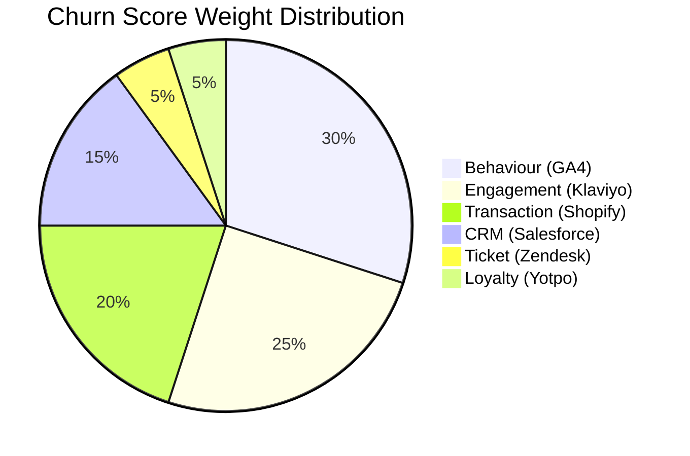

### Scoring Logic per Dimension

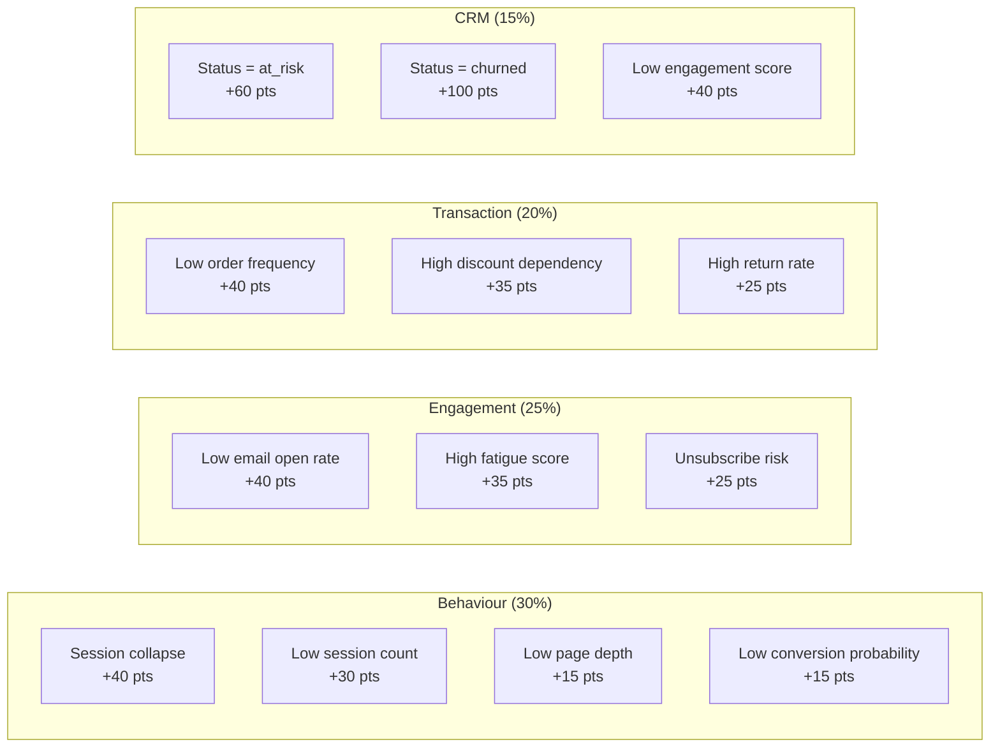

### Risk Thresholds → Intervention Mapping

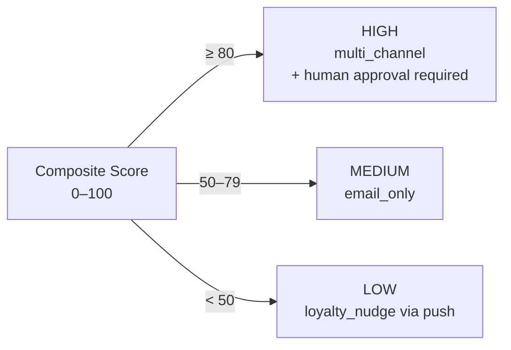

---

## 6. Human-in-the-Loop Approval Flow

For HIGH-risk customers, the graph pauses execution using LangGraph's `interrupt()` primitive. No outreach is sent until a human explicitly approves.

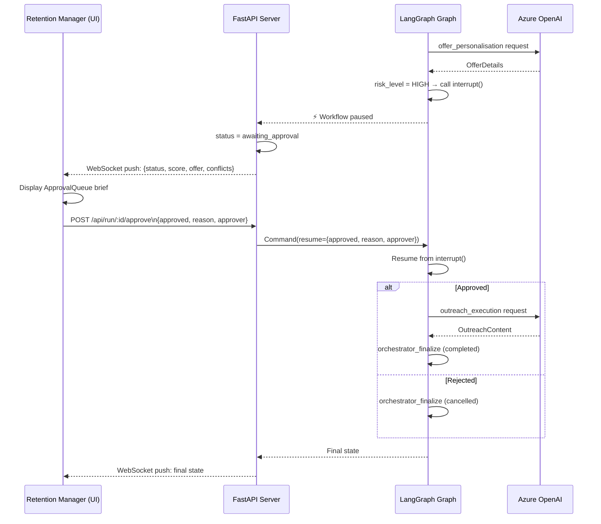

---

## 7. API & Real-Time Communication

### REST Endpoints

| Method | Endpoint | Purpose |
|---|---|---|
| `POST` | `/api/trigger` | Start retention workflow for a customer |
| `GET` | `/api/run/{run_id}` | Snapshot of active workflow state |
| `GET` | `/api/run/{run_id}/audit` | Audit trail entries for a run |
| `POST` | `/api/run/{run_id}/approve` | Submit human approval or rejection |
| `GET` | `/api/runs` | List all runs (paginated, filterable by status) |
| `GET` | `/api/customers` | Mock customer catalogue |
| `GET` | `/api/dashboard` | Aggregate stats (risk distribution, avg score) |
| `GET` | `/api/health` | Liveness probe |
| `WS` | `/ws/{run_id}` | Real-time state push during workflow execution |

### Request/Response Flow

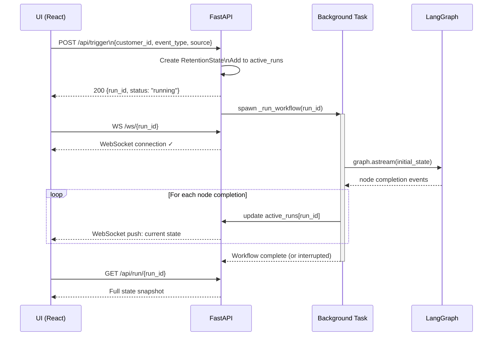

---

## 8. Frontend UI Architecture

### Route Map

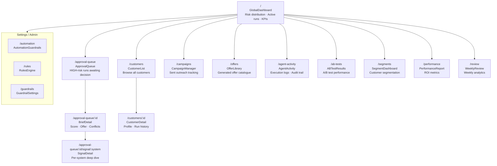

### Frontend Component Data Flow

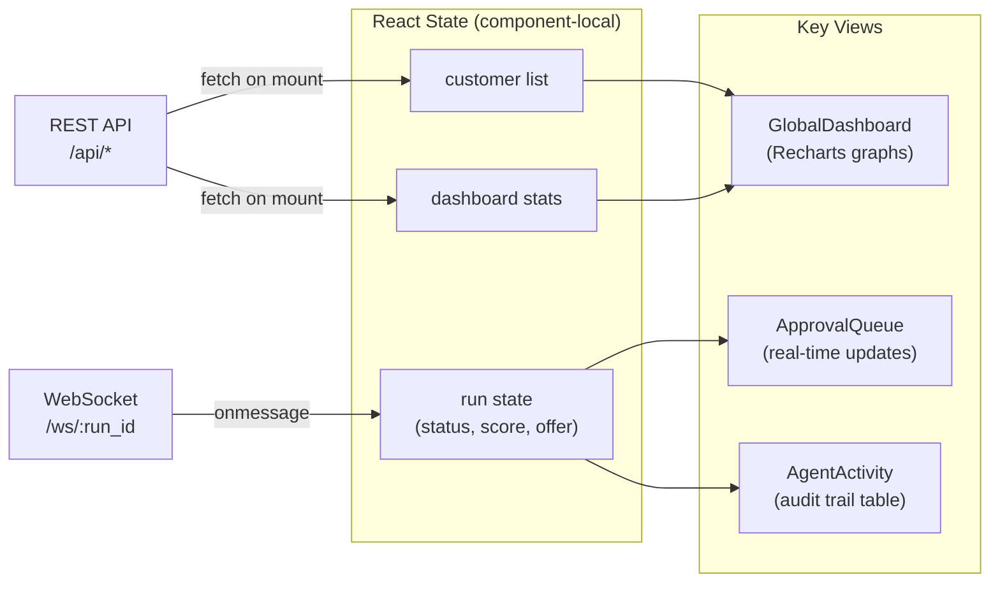

---

## 9. State Machine & Data Model

### RetentionState — Single Source of Truth

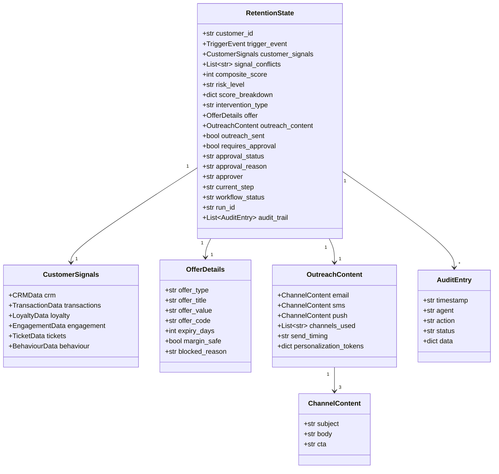

### Workflow Status Transitions

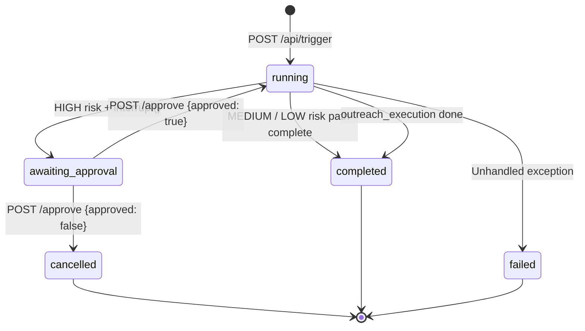

---

## 10. Key Design Decisions

### 10.1 LangGraph over a Simple Task Queue

**Decision:** Use LangGraph's `StateGraph` as the orchestration backbone rather than a Celery task chain or plain async queue.

**Why:**
- Native support for `interrupt()` / `resume()` enables mid-graph human approval without polling hacks
- `MemorySaver` checkpointer persists graph state across the interrupt boundary — no manual state serialization
- Conditional edges (routing based on `risk_level`) are first-class primitives
- Audit trail via `Annotated[List, operator.add]` accumulates naturally without merge conflicts

---

### 10.2 Parallel Signal Aggregation with `asyncio.gather`

**Decision:** All six utility agents are invoked simultaneously using `asyncio.gather` inside the `signal_aggregation` super agent.

**Why:**
- Network I/O to six external systems is the dominant latency driver — parallelism collapses 6 sequential calls into one round-trip
- Each utility agent is stateless and side-effect free — safe to run concurrently
- Results are normalized into `CustomerSignals` only after all six resolve

---

### 10.3 Conflict Detection as a First-Class Output

**Decision:** The signal aggregation step explicitly computes a `signal_conflicts` list, which is surfaced in the approval brief and stored in the audit trail.

**Why:**
- Real-world systems have data lag (CRM updated weekly vs. GA4 real-time) — treating conflicts as signal rather than noise leads to better decisions
- Surfacing conflicts to human approvers lets them catch cases where automation would otherwise act on stale data
- Example: CRM says "active" but GA4 shows session collapse → likely CRM data hasn't been refreshed yet

---

### 10.4 Margin-Safe Offer Selection

**Decision:** The offer personalisation agent refuses to select discount offers when `discount_dependency_ratio > 0.60`.

**Why:**
- Repeatedly discounting for discount-dependent customers trains them to wait for sales, eroding margin
- The agent substitutes `loyalty_bonus` or `exclusive_access` offers instead, preserving perceived value
- This rule is enforced at the GPT prompt level and the `margin_safe` flag is recorded in the audit trail

---

### 10.5 Three-Tier Agent Architecture (Utility → Super → Orchestrator)

**Decision:** Agents are organised into three tiers: stateless utility agents, GPT-enabled super agents, and the LangGraph orchestrator.

**Why:**

```
Orchestrator (LangGraph)
    Manages state, routing, checkpointing

Super Agents (Python + GPT)
    Coordinate utility agents, apply business logic, call LLMs

Utility Agents (Python)
    Single-system connectors — stateless, testable in isolation
```

- Utility agents can be unit-tested and swapped without touching orchestration logic
- Super agents encapsulate the "smart" behaviour (conflict detection, GPT calls) in one layer
- The orchestrator remains a pure state machine — easy to reason about

---

### 10.6 WebSocket for Real-Time UI Updates

**Decision:** A per-run WebSocket connection (`/ws/{run_id}`) pushes state changes to the UI as each graph node completes.

**Why:**
- Long-polling would introduce latency and server load proportional to the number of active runs
- The approval queue UI must reflect interrupt status immediately — delays create a poor human-in-the-loop experience
- WebSocket connections are tracked in `_ws_connections` dict and cleaned up on disconnect

---

### 10.7 In-Memory State Store (MVP Trade-off)

**Decision:** `active_runs` is a Python `dict` in FastAPI process memory; `MemorySaver` is in-process.

**Why (MVP pragmatism):**
- Eliminates external infrastructure dependencies (Redis, Postgres) for initial deployment
- Sufficient for single-instance deployments with low concurrency

**Known limitations (production path):**
- State is lost on server restart
- Cannot scale horizontally without migrating to `RedisCheckpointer` (LangGraph) + external `active_runs` store
- Migration path: replace `MemorySaver` with `AsyncRedisSaver`; move `active_runs` to Redis or Postgres

---

### 10.8 Azure OpenAI over Direct OpenAI API

**Decision:** GPT is accessed via Azure OpenAI endpoint, not `api.openai.com`.

**Why:**
- Enterprise data privacy — Azure OpenAI does not use customer data to train models (required for retail customer PII)
- Consistent with enterprise compliance requirements
- Allows deployment in Azure-native infrastructure for network isolation

---

## 11. Technology Choices

### Backend

| Technology | Version | Role | Alternatives Considered |
|---|---|---|---|
| Python | 3.8+ | Runtime | Node.js (rejected: LangGraph Python-first) |
| LangGraph | 0.2.55+ | Agentic orchestration | LangChain LCEL, Temporal (rejected: overkill for MVP) |
| FastAPI | 0.115+ | REST + WebSocket API | Flask (rejected: no native async WebSocket) |
| Uvicorn | 0.32+ | ASGI server | Gunicorn (rejected: no async support) |
| Pydantic | 2.9+ | Type validation | Marshmallow (rejected: LangGraph native Pydantic) |
| Azure OpenAI | 1.30+ | LLM inference | Anthropic Claude, direct OpenAI (rejected: enterprise compliance) |

### Frontend

| Technology | Version | Role | Alternatives Considered |
|---|---|---|---|
| React | 18.3 | UI framework | Vue, Svelte (rejected: team familiarity) |
| TypeScript | 5.x | Type safety | JavaScript (rejected: scale and maintainability) |
| Vite | 6.3 | Build tool | CRA (rejected: deprecated), Next.js (rejected: SSR not needed) |
| TailwindCSS | 4.1 | Styling | CSS Modules, styled-components |
| Radix UI | latest | Headless components | shadcn/ui (built on Radix), MUI (rejected: opinionated) |
| Recharts | 2.15 | Data visualisation | D3.js (rejected: too low-level), Victory |
| React Router | 7.13 | Client-side routing | TanStack Router |

---

## 12. Security & Operational Considerations

### Secrets Management
- All API keys (Azure OpenAI, external systems) stored in `.env` file, never committed
- `.env.example` provided as a template with placeholder values
- Production: migrate to Azure Key Vault or AWS Secrets Manager

### Data Privacy
- Customer data (PII) processed in-memory only — no persistence to disk in current implementation
- Azure OpenAI selected specifically for enterprise data privacy guarantees
- Audit trail stored in LangGraph `MemorySaver` (in-memory) — must be encrypted at rest for production

### Operational Readiness

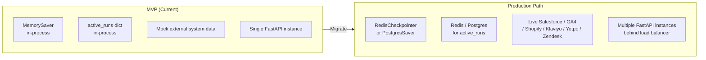

### API Security (Production Checklist)
- [ ] Add OAuth 2.0 / JWT authentication to all REST endpoints
- [ ] Rate-limit `/api/trigger` to prevent workflow spam
- [ ] Validate `customer_id` against authoritative customer store before triggering
- [ ] Restrict WebSocket connections to authenticated sessions
- [ ] Sanitise all GPT outputs before storing in state (prompt injection risk)
- [ ] Add request signing for webhook-style trigger events

---

## Appendix: Mock Customer Test Matrix

| ID | Name | Risk | Score | Key Conflict |
|---|---|---|---|---|
| CUST_001 | Sarah Mitchell | HIGH | ~84 | High loyalty points balance, zero redemptions |
| CUST_002 | James Thornton | MEDIUM | ~55 | CRM says "active" but GA4 shows session collapse |
| CUST_003 | Emma Rodriguez | LOW | ~7 | None — loyal platinum customer |
| CUST_004 | David Chen | HIGH | ~93 | All loyalty points expiring + escalated support ticket |

---

*Document generated from codebase analysis of `c:\Code\AgentCode-Retail` and `c:\Code\Retail_Appex_extracted`.*
